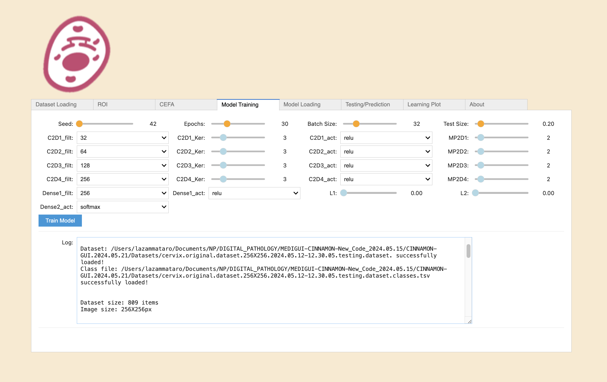

# Summary

Cervical cancer is a significant cause of death for women worldwide. In 2020, there were approximately 604,000 new cases and 342,000 deaths (Sung202121660). This type of cancer is closely linked to persistent infection by certain types of human papillomavirus (HPV), particularly HPV-16 and HPV-18, which account for about 70% of cervical cancer cases (@Walboomers1999, and @Zammataro20191911385116).
The Pap test, also known as the Papanicolaou test, is a widely used screening test for the prevention and early detection of cervical cancer. It involves examining cells collected from the cervix's surface to identify any abnormal cellular changes indicative of potential cancer or precancerous lesions (@PAPANICOLAOU1941193).
However, interpreting Pap test results can be subjective and reliant on the operator's expertise. Additionally, the test's accuracy can be affected by various factors, including sample quality and the presence of dyskeratotic cells, which can be challenging to interpret (@Walavalkar201421346). 
In this paper, we present CINNAMON-GUI (Convolutional Neural Network and Multimodal Learning with a Graphic User Interface), an open-source tool that allows users to configure sophisticated CNN architectures for classifying digital biomedical images from the cervical Pap smear dataset SIPaKMeD (@PLISSITI20188451588).

# Statement of Need

New digital pathology methodologies based on digital image analysis have been developed to enhance the accuracy and effectiveness of cervical cancer diagnosis (@Alsubai20239676206, and @RAHAMAN2021104649). The field of digital pathology has witnessed significant advancements due to the integration of machine learning techniques, particularly convolutional neural networks (CNNs). These technologies have transformed how pathological images are analyzed, enhancing accuracy in diagnosing and classifying cellular anomalies. Moreover, existing commercial platforms utilize Machine learning techniques to automate and refine the analysis of Pap smear tests, aiming to increase the speed and reliability of diagnostics. However, these technologies often come embedded within proprietary systems that are costly and restrictive in terms of customization and scalability.
CINNAMON-GUI is a unique advancement in digital pathology, offering an open-source solution based on convolutional neural networks (CNN) for classifying Pap smear images. Its standout features include a commitment to transparency and collaboration in scientific research and the ability for users to explore, modify, and tailor the code to their specific needs. This promotes continuous innovation and adaptability to new research scenarios. CINNAMON-GUI's open-source approach invites the scientific community to actively contribute to its development actively, enhancing its efficiency and applicability through feedback and updates. With performance that matches or exceeds similar tools, CINNAMON-GUI not only meets but often surpasses expectations regarding accuracy and speed. The future vision for CINNAMON-GUI includes further integrations and enhancements that will continue positioning it as a critical pillar for advancing digital pathology. By presenting specific case studies and precise benchmarking, our tool demonstrates its uniqueness and value in a crowded field, offering an evolving platform that catalyzes scientific and technological progress. By embodying an open-source philosophy, CINNAMON-GUI diverges from traditional trends, democratizing access to cutting-edge technology and allowing a broader range of institutions, including those with limited budgets, to benefit from advanced analytical tools. This collaborative environment not only speeds up the pace of innovation but also enhances the robustness and transparency of the software, ensuring that improvements in digital pathology are not confined to well-funded labs but are accessible to a global community, fostering more inclusive progress in medical research and diagnostics.

# Functionality

CINNAMON-GUI harnesses the power of convolutional neural networks (CNNs) to deliver precision and efficiency in image classification.
The core functionality of CINNAMON-GUI is its sophisticated CNN models, designed to classify intricate patterns in pathology images. Built on the robust TensorFlow framework, the software leverages state-of-the-art machine learning algorithms to ensure high performance and accuracy. CINNAMON-GUI is fully integrated within the Jupyter Notebook and Jupyter Lab environments, offering a user-friendly and intuitive experience for conducting interactive and complex analyses directly within a web browser. The GUI, crafted using ipywidgets, provides a dynamic interface where users can effortlessly adjust critical parameters of the CNN architecture, such as the number of filters, kernel sizes, and activation functions. This extensive configurability allows researchers and practitioners to fine-tune the network according to their specific requirements, significantly enhancing the model's adaptability and overall performance. Additionally, CINNAMON-GUI utilizes Matplotlib to generate visualizations and plots, enriching the user's analytical capabilities by offering detailed insights into data trends and model behaviors.
The software supports loading datasets from `.pickle` files, which conveniently package images and their corresponding labels. This integration simplifies the process of managing large sets of medical images. Additionally, the tool offers functionalities for preprocessing and normalizing images, ensuring they are optimally conditioned for CNN processing.
Training and validation of models are central aspects of CINNAMON-GUI, featuring a user-friendly interface that facilitates the specification of training parameters such as epochs and batch sizes \autoref{fig_1}.

[\label{fig_1}The Cinnamon-GUI Training Tab, users have full control over the adjustments of the CNN architecture.They can fine-tune the filters, the number of neurons, and activation functions, thereby customizing the tool to their specific needs. Additionally, they can manipulate training epochs, batch size, and two regularization parameters to enhance the training performances.](./TrainingTab.png)

The software provides real-time updates on training progress, displayed through a progress bar and detailed logs within a dedicated output window. This not only keeps the user informed but also aids in diagnosing any issues during the training phase.
Visualization tools are a standout feature, offering insights into CNN's operations. Users can generate plots to visualize learning curves, illustrating the training and validation losses and accuracies over time. Moreover, the software can display feature maps from different CNN layers, providing a deeper understanding of how the model processes and interprets the input images.
Model management is handled efficiently, with options to save trained models and their configurations for future use or to load pre-existing models. This functionality ensures that valuable models are preserved and easily shared within the scientific community, promoting reproducibility and collaborative improvements.
CINNAMON-GUI also extends its functionality by integrating external tools such as Labelme directly within the interface. This integration enables users to define regions of interest on images for more focused analysis, highlighting the tool's commitment to providing a comprehensive suite for digital pathology analysis. This integration not only enhances the tool's versatility but also streamlines the analysis process, making it more efficient for the user.

# Application

The SipakMed database, which consists of approximately 4049 color images of cells from cervical pap smears, represents a vital example of this tool. A medical team has classified these images into five cellular subclasses: Superficial-Intermediate Cells, Parabasal Cells, Metaplastic Cells, Koilocytes, and Dyskeratocytes. For our work, the database was restructured into a numpy array and subsequently inserted into a Pandas DataFrame, with each row corresponding to a sequence of 65536 pixels, each represented by an RGB triplet for color and associated with an output label. Once loaded into a NumPy vector, the images are reshaped into 256x256 matrices.
CINNAMON-GUI includes internal functions for image normalization and a suite of functions for randomly splitting the dataset into training and testing sets for CNN learning. Users can select from a wide range of seeds for random splitting via the scikit-learn package using a dedicated sliding bar in the GUI's Training Bar.
Table 1 illustrates the architecture implemented for classifying the SIPaKMeD dataset. With this architecture, the CNN achieved a training accuracy of 91% on the validation test after 30 epochs of learning, with both regularization parameters set to 0.001 and an F1-Score of 0.98. Additionally, a custom cross-validation test using RepeatedKFold was implemented through Scikit-Learn and executed with a 15-fold validation, reaching an accuracy of 99% (std =0.0 ).
The Feature Mapping function of CINNAMON-GUI can be handy for identifying Koilocytes, which are prodromal cells of a transformation into Dyskeratocytes. Koilocytes are squamous cells that exhibit morphological alterations indicative of human papillomavirus (HPV) infection. Koilocytosis is pathognomonic, though not required, for diagnosing low-grade squamous intraepithelial lesions (LSIL). The main morphological alterations observed in koilocytosis include
1) Karyolysis (chromatin within the nucleus appears fragmented and dispersed, giving the nucleus a translucent or granular appearance);
2) Nuclear hypertrophy (the nucleus is more significant than usual and may exhibit increased chromatin density);
3) Increased nuclear/cytoplasmic ratio (the nucleus occupies a more significant proportion of the cellular space compared to the cytoplasm);
4) Clear perinuclear zone (a clear zone is observed around the nucleus, known as the "clear perinuclear zone");
5) Cytoplasmic vacuolization (the cytoplasm may show alterations such as the presence of vacuoles, giving the cell a sponge-like appearance).
For a comprehensive overview of the mentioned cellular traits in various pathological contexts, please see @Walker1994Endonuclease, @Iglesias-Guimarais2013Chromatin, @Zierler2006Ultraviolet, @Errami2012Apoptotic, and @Burton2003A.
Feature mapping, which involves mapping the various layers of the CNN through our software, makes identifying these pathological traits much more accessible, enhancing the accuracy and reliability of medical diagnoses. This feature can be enabled via a checkbox located within the Testing Tab.

# Conclusion

CINNAMON-GUI significantly advances digital pathology by leveraging the power of convolutional neural networks (CNNs) to classify Pap smear images. Its open-source nature promotes transparency, collaboration, and continuous innovation within the scientific community. The tool's integration with the SipakMed database and its sophisticated feature mapping capabilities make the identification of pathological traits more accessible and accurate. By democratizing access to advanced analytical tools, CINNAMON-GUI stands to enhance medical diagnostics and research globally, making impactful contributions to public health.

# References
